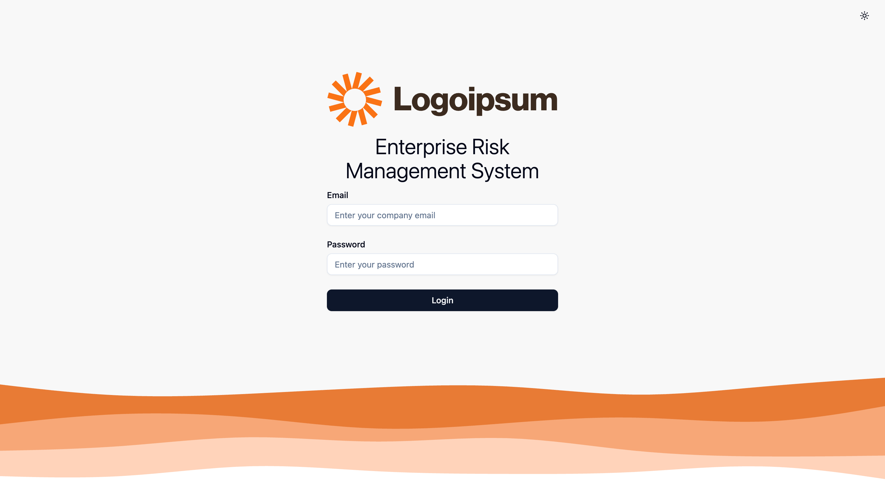
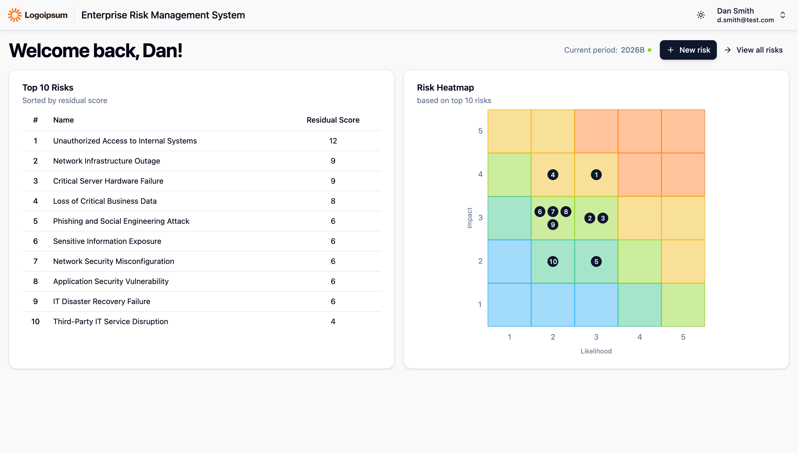
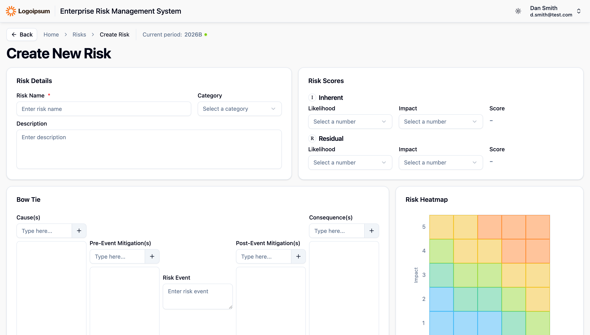
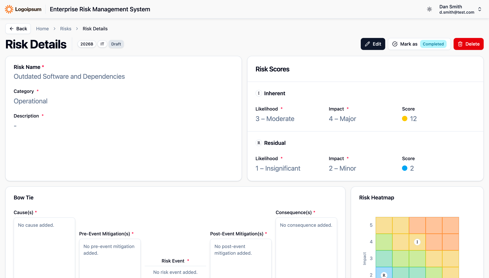
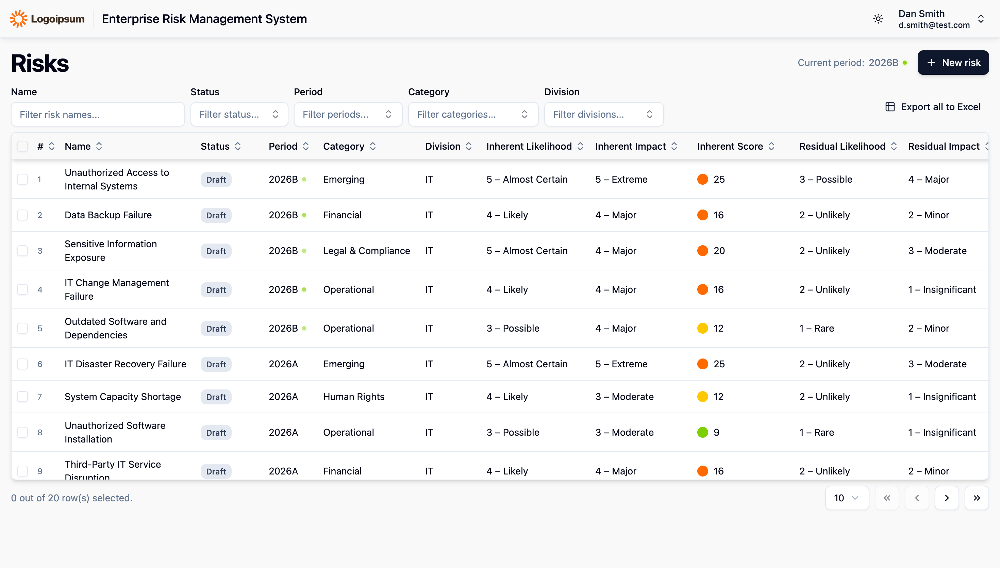
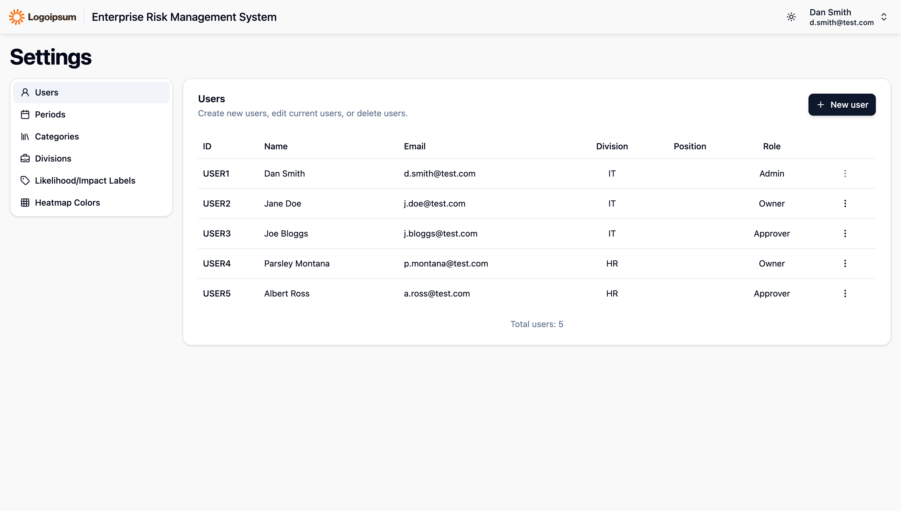

# Enterprise Risk Management System

A web-based Enterprise Risk Management (ERM) system designed to help organizations manage, monitor, and assess business risks throughout their risk management lifecycle.

The system provides a centralized platform for creating, reviewing, monitoring, and managing risk information, with role-based access control and risk visualization.

> **Note:** This project was developed as part of my cooperative education at **Daikin Industries (Thailand) Ltd.**

## Tech Stack

### Frontend

- React
- TypeScript
- Vite
- Tailwind CSS
- React Router
- TanStack Table
- Zod

### Backend

- Bun
- ElysiaJS
- TypeScript

### Database

- PostgreSQL

## My Responsibilities

During my cooperative education project, I was responsible for several parts of the system, including:

- Designing the database schema and relationships
- Designing and implementing REST APIs
- Developing the frontend user interface
- Implementing CRUD functionality for risk management
- Implementing authentication and authorization
- Designing risk visualization and heatmap functionality
- Improving the overall UI/UX based on user requirements

## What I Learned

This project gave me practical experience building an enterprise application and working with an existing organizational environment.

Key areas I worked with include:

- Full-stack web application development
- REST API design
- Relational database design
- Authentication and authorization
- Frontend state and data management
- Database integration
- Enterprise application architecture
- UI/UX design and usability improvements

## Screenshots

### Login Page

### Home

### Create New Risk

### Risk Details

### Risks Index / List View

### Settings / User Management

## Future Improvements

Potential improvements include:

- Automated unit and integration tests
- Improved centralized error handling
- More granular authorization policies
- API response standardization
- Improved API documentation
- CI/CD pipeline
- Production deployment

## License

This project was developed for educational and cooperative education purposes.

Some parts of the system may depend on proprietary organizational infrastructure and are therefore not included in this repository.
